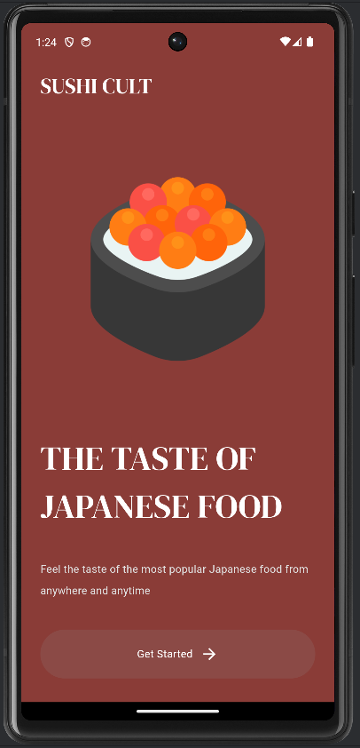
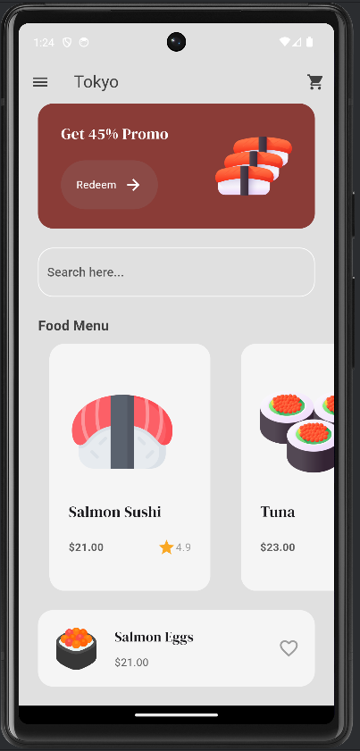
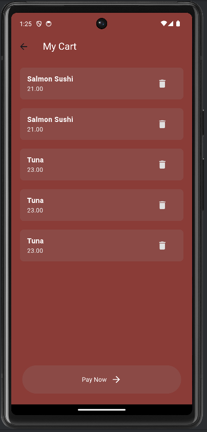
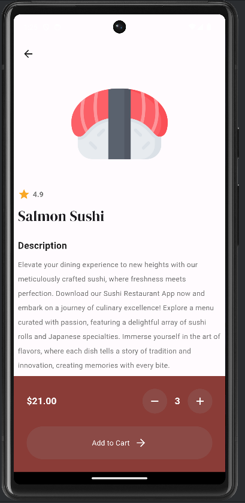

# 🍣 Sushi Cult

**Sushi Cult** is a mobile app for sushi delivery, created as a personal project to experiment with mobile app development and UI/UX design. The app allows users to browse through a sushi menu, add items to a cart, and manage their selections in real-time.

---

## 🚀 Features

- **Dynamic Menu** 🍱: Displays a list of sushi options, each with a name, price, and description. Users can view and select different sushi items.
  
- **Intuitive Navigation** 🧭: The app contains three main pages—`IntroPage`, `MenuPage`, and `CartPage`. Users can navigate between these pages smoothly.

- **Interactive Cart** 🛒: Allows users to add items, adjust quantities, and review the cart before confirming an order. All updates to the cart are reflected instantly.

- **State Management** 🌀: Uses the **Provider** package to manage state across the app, ensuring data consistency between the menu and the cart.

---

## 📐 Architecture

The app follows the **MVVM (Model-View-ViewModel)** design pattern to ensure clear separation of concerns, making the code more modular and maintainable.

### 🔑 Core Components

1. **Models**: The `Shop` model contains the sushi data and manages the cart operations.
  
2. **Views**: The user interface, which includes the pages for the introduction, menu display, and cart review.

3. **Providers**: Facilitates communication between models and views, ensuring data updates are reflected instantly.

---

## 🍙 Models

### Shop Model

The `Shop` model handles the core data and logic for the app, including:

- **menuItems**: A list containing all available sushi options.
- **cartItems**: Stores the sushi items that the user has added to the cart.

#### Key Methods:

- `addItemToCart(MenuItem item)`: Adds the selected item to the cart.
- `removeItemFromCart(MenuItem item)`: Removes an item from the cart.
- `clearCart()`: Empties the cart.

---

## 🖥️ Pages

### 🍱 IntroPage

This is the app's entry page, welcoming users and introducing the sushi selection process.

### 🍣 MenuPage

Displays the list of sushi items. Users can browse the menu and add items to their cart.

### 🛒 CartPage

Shows the items added to the cart, along with options to modify quantities or remove items before finalizing the order.

### 🍤 Product Detail Page

This page provides detailed information about a selected sushi item, including its ingredients, price, and description. Users can add the item directly to the cart from this page.

---

## 📸 Screenshots

### 🍣 1️⃣ Intro Page

### 🍱 2️⃣ Menu Page

### 🛒 3️⃣ Cart Page

### 🍤 4️⃣ Product Detail Page

---

## ⚙️ Conclusion

**Sushi Cult** is a simple demonstration of mobile app development, focusing on state management and a clean, user-friendly interface. It serves as a reflection of my hands-on experience with Flutter and mobile architecture.

